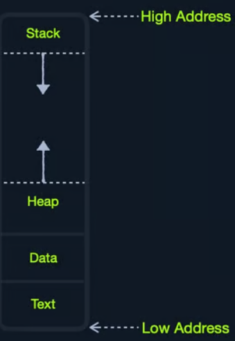

# 🔤 Assembly Basics

## Assembly

**Assembly language** at its basic is an symbolic language that directly ties a language machine can understand and a language that is easy for humans to understand.

An instruction like `add rax, 1` is simpler than machine shellcode equivalent `4883C001` or binary machine code `01001000 10000011 11000000 00000001`

There are different processor architectures and each needs a program to be written on different sets of instructions. This is where low-level languages like `C` come in.

`C` has a complier that compiles a source code to a variety of architectures without writing different source code for each.

### Computer Architecture

The following is the Von Neumann Architecture of modern computers



### Memory

Memory is where the temporary data and instructions reside when a program is running/doing calculations. This is the first place a CPU goes to retrieve and process data. Very fast but also volatile

There are two types of memory:

1. Cache
2. Random Access Memory or RAM

### Cache

Cache memory resides withing the CPU and is extremely fast compared to RAM as it runs on the same clock speed. However it is very limited in size and memory.

There are three levels of cache memory, sorted by their physical closeness to CPU

| **Level**     | **Explanation**                                                                                            |
| ------------- | ---------------------------------------------------------------------------------------------------------- |
| Level 1 Cache | Usually in kilobytes, the fastest memory available, located in each CPU core. (Only registers are faster.) |
| Level 2 Cache | Usually in megabytes, extremely fast (but slower than L1), shared between all CPU cores.                   |
| Level 3 Cache | Usually in megabytes (larger than L2), faster than RAM but slower than L1/L2. (Not all CPUs use L3.)       |

### RAM

Ram is a larger cache memory and much slower than Cache memory. It's also residing physically further from the CPU, hence used after Cache memory.

When a program starts, all of its data and instructions are loaded to the RAM(from storage) to be accessed whenever necessary by the CPU.

RAM is split into four main segments

<figure><figcaption></figcaption></figure>

| **Segment** | **Explanation**                                                                                                                                                                                    |
| ----------- | -------------------------------------------------------------------------------------------------------------------------------------------------------------------------------------------------- |
| Stack       | _Has a Last-in First-out (LIFO) design and is fixed in size. Data in it can only be accessed in a specific order by push-ing and pop-ing data._                                                    |
| Heap        | _Has a hierarchical design and is therefore much larger and more versatile in storing data, as data can be stored and retrieved in any order. However, this makes the heap slower than the Stack._ |
| Data        | _Has two parts: Data, which is used to hold variables, and .bss, which is used to hold unassigned variables (i.e., buffer memory for later allocation)._                                           |
| Text        | _Main assembly instructions are loaded into this segment to be fetched and executed by the CPU._                                                                                                   |

### I/O Storage

Input/Output devices are storage unit, keyboard, screen etc. The processor can access and control IO devices using `Bus Interfaces`. These are metallic 'highways' on a PCB that help transmission of electrical charges as binary data.

Each Bus has a capacity of how much electric charge(or bits) it can carry at a given moment. This is usually a multiple of a nibble(half of a byte) up to 128-bits.

Bus interfaces are used to access memory and components outside the CPU. This is why there are countless bus interfaces around the CPU.

By speed here are memory components sorted

| Component | Speed                        | Size      |
| --------- | ---------------------------- | --------- |
| Registers | Fastest                      | Bytes     |
| L1 Cache  | Fastest, after Registers     | Kilobytes |
| L2 Cache  | Fast after L1                | Megabytes |
| L3 Cache  | Slower than all of the above | Megabytes |
| RAM       | Slower than all of the above | GB-TB     |
| Storage   | Slowest                      | TB+       |

## CPU Architecture

CPU is the main processing unit within a computer. The CPU contains the `Control Unit(CU)`, which is in charge of moving and controlling data and there's `Arithmetic/Logic Unit(ALU)`, which is in charge of performing arithmetic and logical calculations as requested.

Efficiency of a CPU and which instructions it can run depends on its `Instruction Set Architecture(ISA)`. `RISC` architecture is based on processing more simple instructions, which takes more cycles but each cycle is shorter and takes less power. `CISC` architecture is based on processing fewer, more complex instructions, which takes less instructions and fewer cycles but each instruction takes more time and power.

A `clock speed` refers to each tick given one cycle of an operation that it takes to process a basic instruction, like fetching an address or storing one.

The frequency of cycles is measured in `Hertz`. Example: CPU speed with 2.0GHz means that it can run 2 billion cycles every second(per core).

### Instruction Cycle

An `Instruction Cycle` is the cycle it takes the CPU to process a single machine instruction It consists of four stages:

| 1. Fetch    | Takes the next instruction's address from the Instruction Address Register (IAR), which tells it where the next instruction is located. |
| ----------- | --------------------------------------------------------------------------------------------------------------------------------------- |
| 2. Decode   | Takes the instruction from the IAR, and decodes it from binary to see what is required to be executed.                                  |
| 3. Execute  | Fetch instruction operands from register/memory, and process the instruction in the ALU or CU.                                          |
| 4. Store    | Store the new value in the destination operand.                                                                                         |
| An example: |                                                                                                                                         |

1. Fetch the instruction from the `rip` register, `48 83 C0 01` (in binary).
2. Decode `48 83 C0 01` to know it needs to perform an `add` of `1` to the value at `rax`.
3. Get the current value at `rax` (by `CU`), add `1` to it (by the `ALU`).
4. Store the new value back to `rax`.

each processor has its own set of instructions and corresponding machine code. So, each processor type has its Instruction Set Architectures, and each architecture can be further represented in several syntax formats

### Instruction Set Architectures

ISA specifies the syntax and semantics of the assembly language. It consists of

* Instructions - `add rax, 1, mov rsp, rax, push rax`
* Registers - `rax, rsp, rip`
* Memory Addresses - `0xffffffffaa8a25ff, 0x44d0, $rax`
* Data Types - `byte, word, double word`

There are two main ISA that are used widely:

1. CISC - used by Intel and AMD processors
2. RISC - used in ARM and Apple processors, in most smartphones and some laptops

### Registers, Addresses and Data Types

#### Registers

CPU has a set of registers, which are the fastest components on any computer, because they are built within the CPU core. Regardless, registers are limited in size and can hold only a few bytes of data at a time. The following are the essential registers

| Data Registers    | Pointer Registers         |
| ----------------- | ------------------------- |
| rax (primary)     | rbp (Base pointer)        |
| rbx (primary)     | rsp (Stack pointer)       |
| rcx (primary)     | rip (Instruction Pointer) |
| rdx (primary)     |                           |
| rdi (destination) |                           |
| rsi (source)      |                           |
| r8 (secondary)    |                           |
| r9 (secondary)    |                           |
| r10 (secondary)   |                           |

_Note: letter r at the beginning of registers denote that these are 64-bit registers. letter e denotes that they are 32-bit registers . Like `eax` or `ebp`_

**Data Registers** are used for storing instructions/syscalls.

**Pointer Registers** are used to store specific memory address pointers **rbp** - points to beginning of the Stack **rsp** - points to the current location within the Stack **rip** - holds the address for the next instruction

Each register can be further divided into smaller sub-registers containing lower bits: 8-bits, 16-bits, 32-bits

<figure><figcaption></figcaption></figure>

| Size   | Example |
| ------ | ------- |
| 8-bit  | `al`    |
| 16-bit | `ax`    |
| 32-bit | `eax`   |
| 64-bit | `rax`   |

#### Memory Addresses

Memory is segmented into memory regions, like the Stack, Heap and other program and kernel-specific regions. Each segment has specific read, write, execute permissions that specifies what can be done in that segment.

whenever an instruction is called, the first step is to fetch the instruction from the address it's located at. Several types of address fetching in x86

| Addressing mode | Explanation                                               | Example                         |
| --------------- | --------------------------------------------------------- | ------------------------------- |
| Immediate       | The value is given withing the instruction                | `add 2`                         |
| Register        | The register that holds the value is given to instruction | `add rax`                       |
| Direct          | The full address is given in the instruction              | `call 0xffffffffaa8a25ff`       |
| Indirect        | A reference pointer is given in the instruction           | `call 0x44d000` or `call [rax]` |
| Stack           | Address on top of the stack is passed to the instruction  | `add rsp`                       |

#### Endianness

An address endianness is the order of its bytes in which they are stored or retrieved from memory. There are two types of endianness: `Little-Endian` and `Big-Endian`. With **Little-Endian** processors, the little-end byte of the address is retrieved right-to-left Example: an address `0x0011223344556677` will be stored in reverse -> `0x7766554433221100`

With **Big-Endian** processors, the big-end byte is retrieved left-to-right

In little endian, if we were to push an address or a string with Assembly, we would have to push it in reverse. For example, if we want to store the word `Hello`, we would push its bytes in reverse: `o`, `l`, `l`, `e`, and finally `H`.

#### Data Types

x86 architecture supports several data types

| Data type | Length  |
| --------- | ------- |
| byte      | 8 bits  |
| word      | 16 bits |
| dword     | 32 bits |
| qword     | 64 bits |

## Assembly File Structure

```assembly
         global  _start

         section .data
message: db      "Hello"

         section .text
_start:
         mov     rax, 1
         mov     rdi, 1
         mov     rsi, message
         mov     rdx, 18
         syscall

         mov     rax, 60
         mov     rdi, 0
         syscall

```

In the example above we have

| Section         | Explanation                                                                               |
| --------------- | ----------------------------------------------------------------------------------------- |
| `global _start` | This is a `directive` for the code to start executing at the `_start` label defined below |
| `section .data` | This is a `data` section, which should contain all of the variables                       |
| `section .text` | This is a `text` section containing all of the code that should be executed               |

### Directives

An assembly code runs line-by-line. Directives like `global _start` indicates the machine where to start processing instructions. So, the machine goes to the `_start` label and starts executing the instructions there.

### Variables

The `.data` section holds variables that will be loaded into memory once the program is run

Variables can be defined using `db` for a list of bytes, `dw` for a list of words and `dd` for a list of digits and so on. it is also possible to label variables for later usage

| Instruction                         | Description                                   |
| ----------------------------------- | --------------------------------------------- |
| `db 0x0a`                           | defines the byte `0x0a` which is a newline    |
| `message db 0x41, 0x42, 0x43, 0x0a` | Defines the label `message => abc\n`          |
| `message db "Hello World!", 0x0a`   | Defines the label `message => Hello World!\n` |
| In an example below                 |                                               |

```assembly
section .data
    message db "Hello World!", 0x0a
    length  equ $-message
```

`$` token indicates the current distance from the beginning of the current section.

### Code

`.text` section holds all assembly instructions and loads them to the `text` memory segment. Once all instructions are loaded, then the processor starts executing them in order.

The `text` segment within the memory is read-only, so we cannot write any variables within it.

The `data` section is read/write, which is why we write our variables to it.

## Assembly basic instructions

### Moving data around

Data movement is one of the fundamental instructions in any assembly program. The main `Data Movement` instructions are:

| Instruction | Explanation                                  | Example            |
| ----------- | -------------------------------------------- | ------------------ |
| `mov`       | Move data or load immediate data             | `mov rax, rip`     |
| `lea`       | Load an address pointing to the value        | `lea rax, [rsp+5]` |
| `xchg`      | Swap data between two registers or addresses | `xchg rax,rbx`     |

#### Example 1: moving data to a register

```assembly
global _start

section .text
_start:
 mov rax, 0 ; move value 0 to rax
 mov rbx, 1 ; move value 1 to rbx
 mov al, 1  ; move 1-byte into a 1-byte register(al) 
```

assembling `asm.s` using `nasm` `nasm -f elf64 asm.s && objdump -M intel -d asm.o`

#### Example 2: moving pointer values

```assembly
global _start

section .text
_start:
 mov rax, rsp
 mov rax, [rsp]
```

Square brackets `[]` tells `nasm` to move whatever the value is at address `rsp` to `rax`

#### Example 3: Loading value pointers using lea

```
global _start

section .text
_start:
 lea rax, [rsp+10] ; loads rsp+10 address space to rax
 mov rax, [rsp+10] ; loads value at rsp+10 address space to rax
```

### Arithmetic Instructions

Arithmetic instructions are split in `Unary` and `Binary` operands.

#### Unary

Unary instruction take only one argument

| Instruction | Explanation    | Example             |
| ----------- | -------------- | ------------------- |
| `inc`       | Increment by 1 | `inc rax` = `rax++` |
| `dec`       | Decrement by 1 | `dec rax` = `rax--` |

#### Binary

Binary instruction, namely takes two arguments

| Instruction                                                               | Explanation                                        | Example         |
| ------------------------------------------------------------------------- | -------------------------------------------------- | --------------- |
| `add`                                                                     | Add both operands                                  | `add rax, rbx`  |
| `sub`                                                                     | Subtract Source from Destination `rax = rax - rbx` | `sub rax, rbx`  |
| `imul`                                                                    | Multiply both operands                             | `imul rax, rbx` |
| result is always stored in the destination register. source stays intact. |                                                    |                 |

#### Bitwise

Bitwise instructions work on the bit level

| Instruction | Explanation                                               | Example        |
| ----------- | --------------------------------------------------------- | -------------- |
| `not`       | Bitwise NOT(inverts all bits)                             | `not rax`      |
| `and`       | Bitwise AND(if both bits are 1 -> 1, if both 0 -> 0)      | `and rax, rbx` |
| `or`        | Bitwise OR(if either is 1->1, if both 0->0)               | `or rax, rbx`  |
| `xor`       | Bitwise XOR(if bits are the same -> 0. if different -> 1) | `xor rax, rbx` |

```
global _start

section .text
_start:
    xor rax, rax ; 0
    xor rbx, rbx; 0
    add rbx, 15; rbx = 0x0F
    xor rbx, 15; 0
```

## Program Control Instructions

Control instructions allows to change the flow of the program and direct it to another line. We have `Directives`, `Loops`, `Branching`, `Function Calls`

### Loops

A loop in assembly is a set of instructions that repeat for `rcx` times.

```
global _start

section .text
_start:
        xor rax, rax ; rax = 0
        xor rbx, rbx ; rbx = 0
        inc rbx      ; rbx = 1
        mov rcx, 10  ; loop 10 times

loopFib:
        add rax, rbx ; get the next number
        xchg rax, rbx; swap values
        loop loopFib ; 
```

In the example above `rcx` register in `mov rcx, 10` is a general-purpose register, but for `loop` it has a special purpose.

`loop` checks `rcx` value each time that loop block executes and decreases `rcx` value each time. This loop runs until `rcx` is 0.

How does `loopFib` gets executed? `loopFib:` is just a label which gets translated to an address of `add rax, rbx` at runtime. While `loop loopFib` tells assembly where to jump at each iteration. This `loop` instruction checks that `rcx`>0 value before executing another loop.

### Branching

Branching allows `jump`-ing to any location in the program if a condition is met. The most basic branching instruction is `jmp` which will always be triggered no matter the conditions.

An example

```assembly
global  _start

section .text
_start:
    xor rax, rax    ; initialize rax to 0
    xor rbx, rbx    ; initialize rbx to 0
    inc rbx         ; increment rbx to 1
    mov rcx, 10
loopFib:
    add rax, rbx    ; get the next number
    xchg rax, rbx   ; swap values
    jmp loopFib
```

In this example, even though `mov rcx, 10` is present, it won't affect `jmp loopFib` because `jmp` is an unconditional instruction and will continue running the loop forever.

#### Conditional Branching

| Instruction                                                                                                                    | Explanation |
| ------------------------------------------------------------------------------------------------------------------------------ | ----------- |
| jz                                                                                                                             | DST == 0    |
| jnz                                                                                                                            | DST != 0    |
| js                                                                                                                             | DST < 0     |
| jns                                                                                                                            | DST >= 0    |
| jg                                                                                                                             | DST > SRC   |
| jge                                                                                                                            | DST >= SRC  |
| jl                                                                                                                             | DST < SRC   |
| jle                                                                                                                            | DST <= SRC  |
| Branching is not only done with jumping. It can also be combined with other instructions like `mov` with `CMOVcc` and `SETcc`. |             |

An example of `mov rax, rbx` but on the condition of `== 0` `cmovz rax, rbx` Similarly for `<` `cmovl rax, rbx`

Similarly for `set` `setz rax`

#### RFLAGS

RFLAGS(are 64-bit) register sets the necessary flags to either `0` or `1` depending a certain condition is met. For example, if `sub` instruction resulted in a negative value, then the SIGN FLAG `SF` will be set to `1`. If `dec` instruction resulted in `0`, then ZERO FLAG `ZF` will be set to `1` and so on.

There are several `RFLAGS` that are present in assembly programs, each with its own flag bit.

| Bit location | Label | Explanation               |
| ------------ | ----- | ------------------------- |
| 0            | CF    | Carry Flag                |
| 1            |       | _Reserved_                |
| 2            | PF    | Parity Flag               |
| 3            |       | _Reserved_                |
| 4            | AF    | Auxiliary Carry Flag      |
| 5            |       | _Reserved_                |
| 6            | ZF    | Zero Flag                 |
| 7            | SF    | Sign Flag                 |
| 8            | TF    | Trap Flag                 |
| 9            | IF    | Interrupt Flag            |
| 10           | DF    | Direction Flag            |
| 11           | OF    | Overflow Flag             |
| 12-13        | IOPL  | I/O Privilege Flag        |
| 14           | NT    | Nested Task               |
| 15           |       | _Reserved_                |
| 16           | RF    | Resume Flag               |
| 17           | VM    | Virtual-x64 Mode          |
| 18           | AC    | Access Control            |
| 19           | VIF   | Virtual Interrupt Flag    |
| 20           | VIP   | Virtual Interrupt Pending |
| 21           | ID    | Identification Flag       |
| 22-63        |       | _Reserved_                |

`RFLAGS` - 64 bit `EFLAGS` - 32 bit `FLAGS` - 16 bit

Important flags

* The Carry Flag `CF`: Indicates whether we have a float.
* The Parity Flag `PF`: Indicates whether a number is odd or even.
* The Zero Flag `ZF`: Indicates whether a number is zero.
* The Sign Flag `SF`: Indicates whether a register is negative.

```assembly
global  _start

section .text
_start:
    xor rax, rax    ; initialize rax to 0
    xor rbx, rbx    ; initialize rbx to 0
    inc rbx         ; increment rbx to 1
loopFib:
    add rax, rbx    ; get the next number
    xchg rax, rbx   ; swap values
    cmp rbx, 10  ; do rbx - 10
    js loopFib  ; jump if result is <0
```

in the example above, `cmp` instruction has been added. All it does is subtract second argument from first and set necessary flags in RFLAGS register. Then jump instruction checks flag condition and continues accordingly. In this case after first number is calculated `cmp rbx, 10` will result in `-9`. `js` will continue loop since its condition is `UNTIL DST < 0`

## Functions

### The Stack

The Stack is a segment of memory allocated for each program to store data in. It is used to temporarily store and retrieve data. Top of the stack is referred by the Top Stack Pointer `rsp` and bottom is referred as Base Stack Pointer `rbp`.

Data can either be `push`ed or `pop`'d from the stack. `push` Copies the specified register/address to the top of the stack. `pop` moves the item at the top of the stat to the specified register/address.

The stack has Last-in First-out (LIFO) design. This means we can only `pop` out the element that is at the top of the stack. If we `push` five more elements on top of it, we'll have to pop all of them before accessing that last element.

Before calling `functions` or `syscalls` we need to save data to the stack. Otherwise the data will be lost. For example if we wanted to retain the current value at `rax` and run a syscall, we would first `push rax` to the stack and then call the function.

Using the stack is very simple. The only thing we should keep in mind is the order we push our registers and the state of the stack to safely restore our data and not restore a different value by pop when a different value is at the top of the stack.
